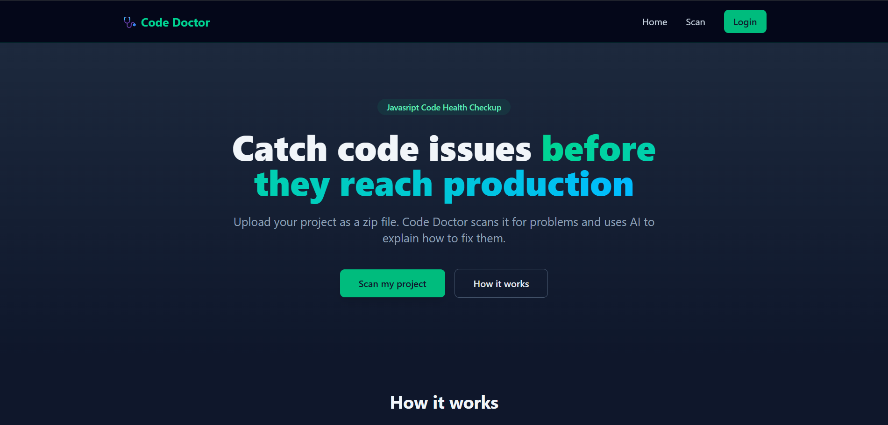
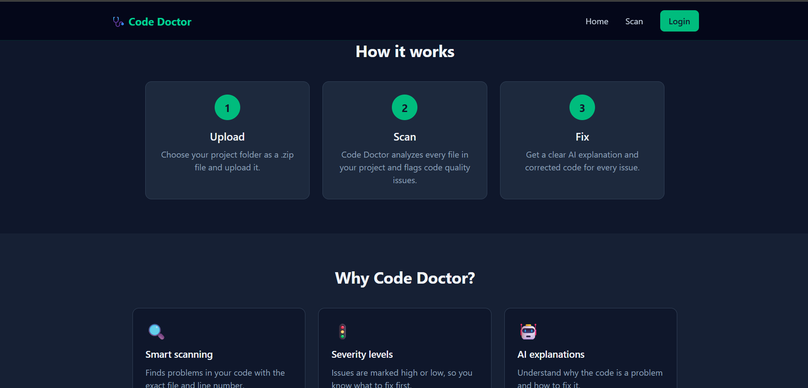
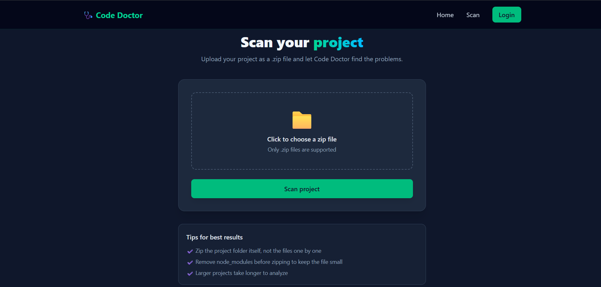
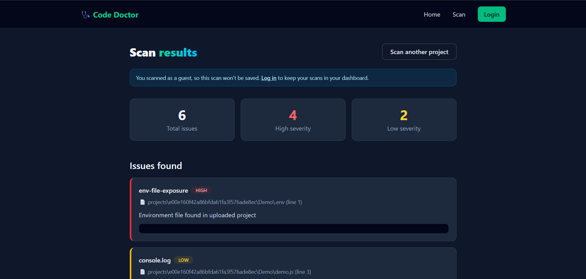
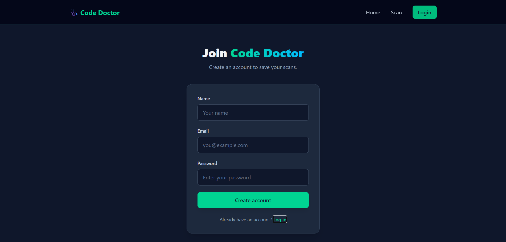
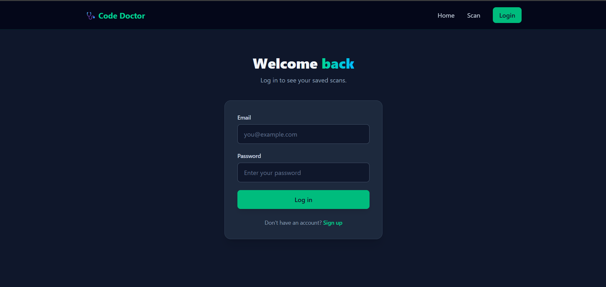
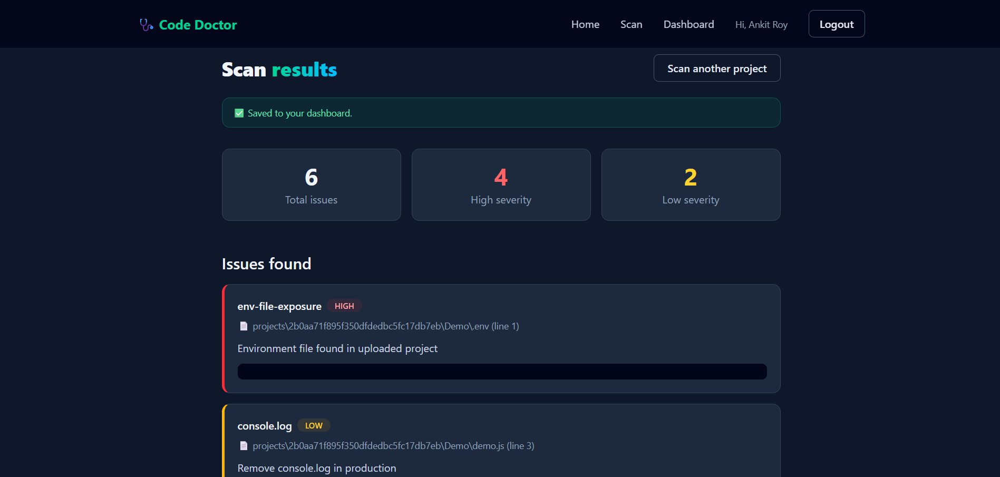
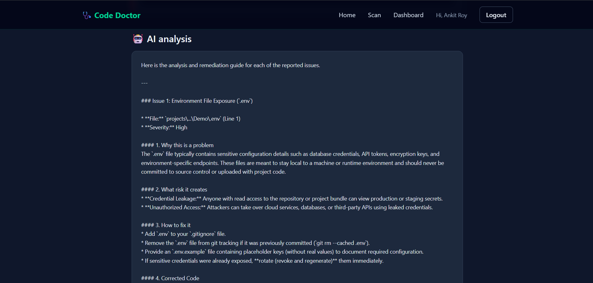
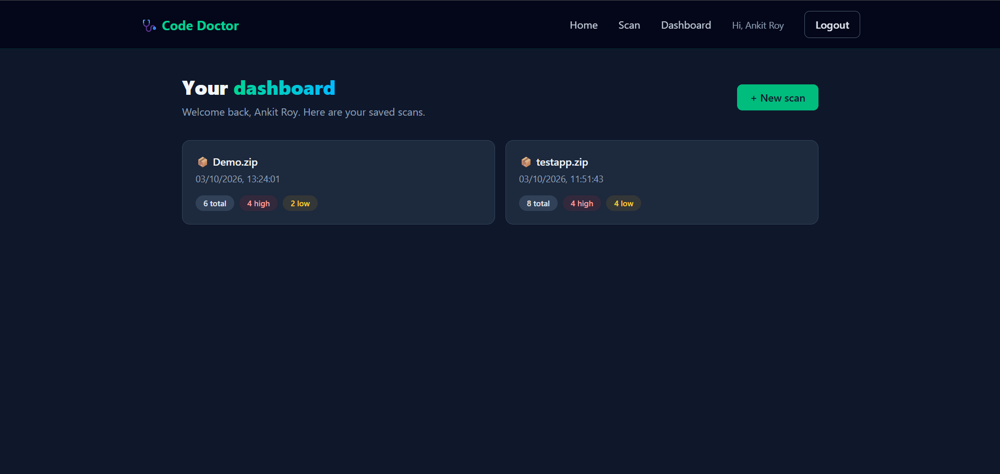

# 🩺 Code Doctor

Code Doctor is a full stack web app that scans a JavaScript project for common code issues and security-related problems and explains how to fix it. Upload your project as a `.zip` file, get every issue with its file, line number and severity, and read an AI-generated explanation with corrected code.

Guests can scan a project instantly. Logged-in users also get their scans saved to a personal dashboard.



## Features

- Upload a project as a `.zip` file and scan it automatically
- Issues listed with file name, line number, code snippet and severity (high or low)
- Detects problems such as exposed `.env` files and leftover `console.log` statements
- AI explanations from the Gemini API: why it is a problem, the risk, how to fix it, and corrected code
- Guest mode: scan without an account (results are not saved)
- Register and login with JWT authentication and hashed passwords
- Personal dashboard with saved scans, newest first
- Reopen any saved scan from the dashboard
- Responsive dark UI built with Tailwind CSS

## Screenshots

### Landing page



### Upload a project



### Results as a guest

Guests see the full results, with a note that the scan will not be saved.



### Register and login

<table>
  <tr>
    <td></td>
    <td></td>
  </tr>
</table>

### Results as a logged-in user

Logged-in users see the same results, and the scan is saved to their dashboard.



### AI analysis

For every issue, Gemini explains why it is a problem, what risk it creates, how to fix it, and shows the corrected code.



### Dashboard

All saved scans in one place. Click a scan to reopen its full results.



## Tech Stack

| Layer | Technologies |
|---|---|
| Frontend | React, Vite, React Router, Axios, Tailwind CSS, Context API |
| Backend | Node.js, Express, Multer, adm-zip |
| Database | MongoDB, Mongoose |
| Auth | JSON Web Tokens (JWT), bcryptjs |
| AI | Google Gemini API (`@google/genai`) |

## How It Works

1. The user uploads a `.zip` file from the Scan page.
2. The backend extracts the zip and scans the files for code issues.
3. The issues are sent to Gemini, which explains each one and suggests a fix.
4. If the user is logged in, the scan is saved to MongoDB under their account.
5. The Results page shows the summary, the issue list and the AI analysis.

Scanning uses an optional auth middleware: a request with a valid token is saved to the user's history, and a request without one is treated as a guest scan.

## Project Structure

```
Code Doctor/
├── Backend/
│   ├── ai/              # Gemini prompt and API call
│   ├── config/          # MongoDB connection
│   ├── controllers/     # scan, auth and history logic
│   ├── middleware/      # optionalAuth and requireAuth
│   ├── models/          # User and Scan schemas
│   ├── routes/          # API routes
│   ├── scanner/         # code scanning logic
│   └── server.js
├── Frontend/
│   └── src/
│       ├── components/  # Navbar
│       ├── context/     # AuthContext
│       ├── pages/       # Home, Scan, Results, Dashboard, Auth
│       └── api.js       # all backend calls
└── screenshots/         # images used in this README
```

## API Endpoints

| Method | Endpoint | Access | Description |
|---|---|---|---|
| POST | `/api/auth/register` | Public | Create an account |
| POST | `/api/auth/login` | Public | Log in and receive a token |
| POST | `/api/scan` | Guest or user | Scan a zip file (saved only for logged-in users) |
| GET | `/api/scans` | Logged in | List my saved scans |
| GET | `/api/scans/:id` | Logged in | Get one full scan |

## Getting Started

### Prerequisites

- Node.js 18 or later
- A MongoDB database (MongoDB Atlas free tier or a local instance)
- A Gemini API key

### 1. Clone the repository

```bash
git clone https://github.com/amanroypeak/Code-Doctor.git
cd Code-Doctor
```

### 2. Set up the backend

```bash
cd Backend
npm install
```

Create a `.env` file in the `Backend` folder:

```
MONGO_URI=your_mongodb_connection_string
JWT_SECRET=a_long_random_secret
GEMINI_API_KEY=your_gemini_api_key
```

Start the server:

```bash
npm run dev
```

Use `npm start` to run without auto-restart. The backend runs on `http://localhost:5000`.

### 3. Set up the frontend

```bash
cd Frontend
npm install
```

Create a `.env` file in the `Frontend` folder:

```
VITE_API_URL=http://localhost:5000/api
```

Start the app:

```bash
npm run dev
```

The frontend runs on `http://localhost:5173`.

## Environment Variables

| File | Variable | Purpose |
|---|---|---|
| Backend/.env | `MONGO_URI` | MongoDB connection string |
| Backend/.env | `JWT_SECRET` | Secret used to sign tokens |
| Backend/.env | `GEMINI_API_KEY` | Gemini API key |
| Frontend/.env | `VITE_API_URL` | Base URL of the backend API |

Never commit your `.env` files.

## Future Improvements

- Delete saved scans from the dashboard
- Render the AI analysis as formatted Markdown
- Support more languages beyond JavaScript
- Automatic cleanup of uploaded files after each scan
- Upload size limits and rate limiting for public deployment

## Author

**Aman Roy**

- GitHub: [Github](https://github.com/amanroypeak)
- LinkedIn:[LinkedIn](https://linkedin.com/in/amanroydev)
